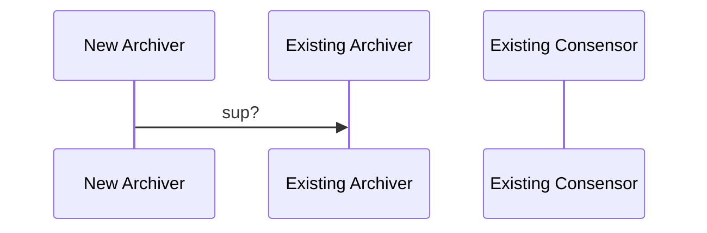

# Architecture

## Required Context

This is how data flows in full-featured DApps built on Shardus:

 

  

 

Monitors provide a view of Consensor status, and Explorers provide tx metrics/data and the ability to validate tx receipts.

Consensors and Archivers are the only nodes required for the DApps backend to work.

Consensors process txs by coming to consensus on their order and validity.

Archivers have multiple responsibilites:

- They keep track of Consensors in the network to let Consensors outside the network join them.
-

## CASE 1: Archiver Starts a Brand New Network

## CASE 2: Archiver Joins an Existing Network

