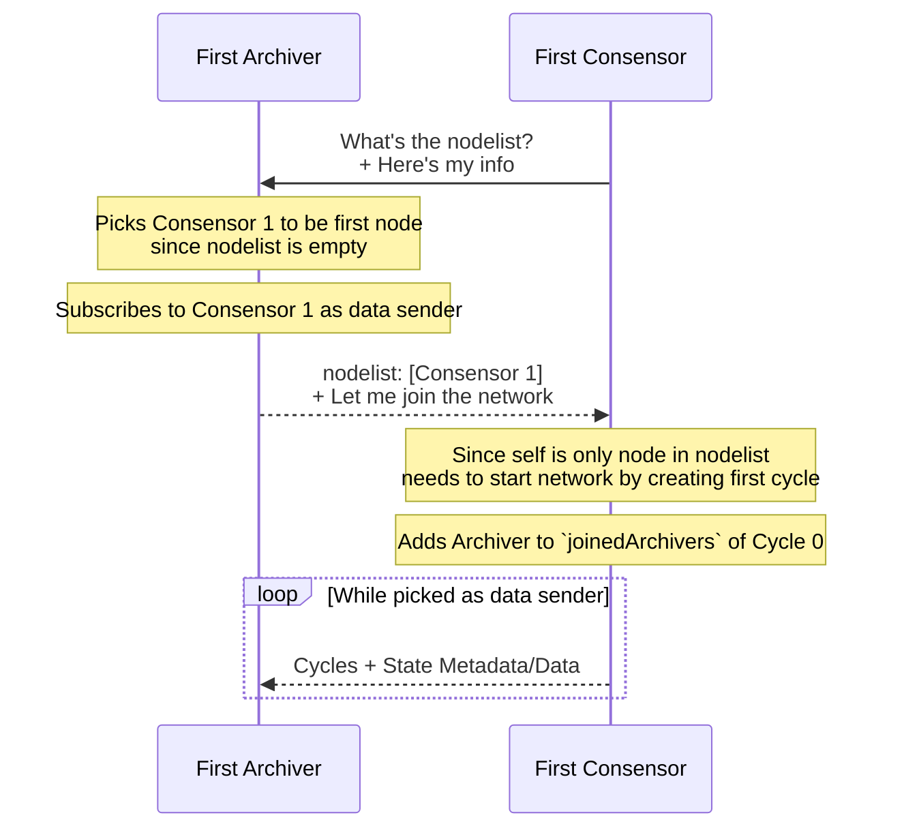
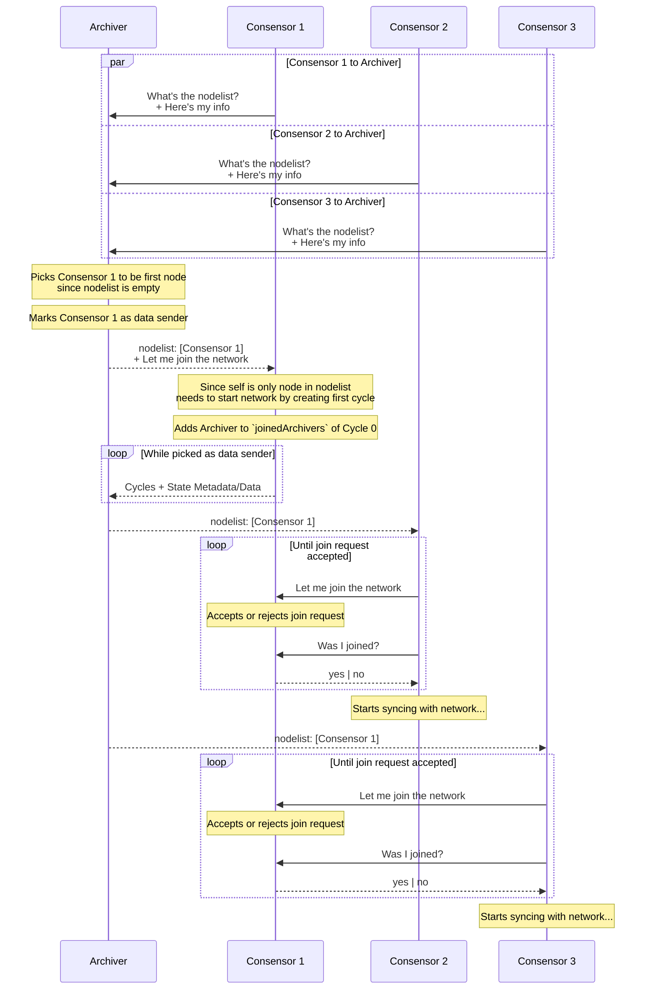

# Architecture

## 1. Required Context

The figure below outlines the expected data flow of a DApp built with Shardus:

</br>
<div align="center">
  
</div>
</br>

A network of Consensors and Archivers is required for the DApp's backend to work. Monitors and Explorers are non-essential and provide meta information about the network.

Consensors are the source of truth and decision making in the network, and have final say on its current state and who its participants are. Archivers are record keepers of the participants and state of the network over time, and publish a list of current network participants for nodes wishing to join it.

The history stored by Archivers can be limited, or reach back to the genesis of the network, as needed by the application.

Consensors are responsible for:

- Storing state data and metadata in a partitioned way.
- Processing txs and applying changes to state data and metadata in a partitioned way.
- Allowing new Consensors and Archivers into the network.

Archivers are responsible for:

- Keeping a running history of Consensors and Archivers in the network.
- Collecting and archiving state metadata and (optionally) data across all partitions, over time.
- Publishing a list of Consensors currently participating in the network.

To join a network, Consensors and Archivers must be started with the information of at least one Archiver in that network.

## 2. Starting a New Network (Network Genesis)

### **CASE 1: One Archiver, One or More Consensors**

To start a network with one Archiver and one or more Consensors:

1. An Archiver must be started without knowledge of any other Archivers
2. The Consensors must be started with the information of the first Archiver.

The first Archiver and first Consensor follow a special procedure to ensure that the Consensor generates proof for itself and the Archiver being network participants, and that the Archiver is able to publish that proof for other Consensors that want to join.

This procedure is illustrated below:



This procedure works even when multiple Consensors are configured with the same Archiver and started at the same time. The Archiver picks the first Consensor to reach it as the first node in the network, and as the creator of the first Cycle. The Archiver then responds to any other nodes that want to join the network with the first Consensors information:



### **CASE 2: One or More Archivers, One or More Consensors**

To start a network with multiple Archivers:

1. One Archiver must be started without knowledge of any other Archivers.
2. All other Archivers must be started with the information of the first Archiver.
3. All Consensors must also be started with the information of the first Archiver.

### **API Endpoints, Data Structures, and Configuration Parameters for Implementation**

#### **Archiver**

Interfaces & Data Structures

```ts
interface ConsensusNodeInfo {
  ip: string
  port: number
  publicKey: string
  id?: string
}

const nodelist: ConsensusNodeInfo[]
```

API Endpoints

1. `/nodelist`

Open to anyone

Returns a list of consensus servers from the list of known consensus servers. But if that is empty use the temporary consensus server. If there are no known consensus servers and no temporary consensus server, return an empty list, unless the “first node” parameter was provided in which case add the requesting server to the temporary consensus server list and return that. If there are many known consensus servers limit the list to 10 servers from the middle of the list.

Request:

```ts

```

Response:

```ts

```

2. `/endpoint2`

### **Consensor**

## 2. Archiver Joins an Existing Network
